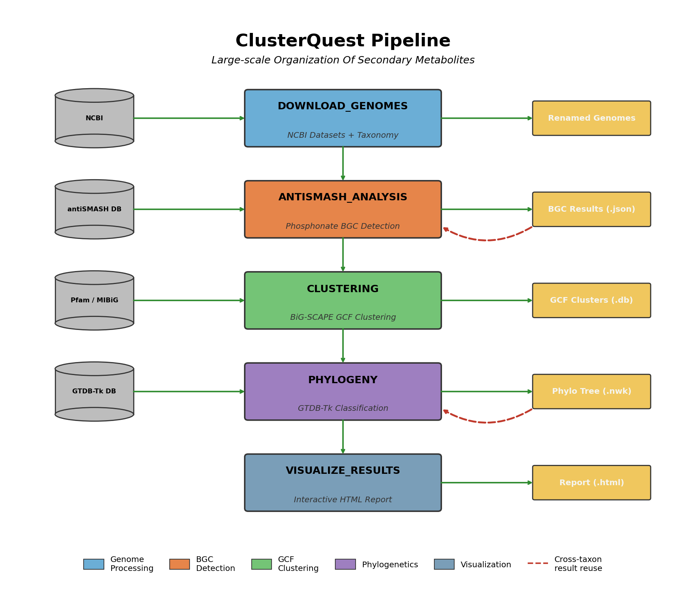

# ClusterQuest

**Large-scale Organization of Secondary Metabolites**

[](https://www.nextflow.io/)
[](https://opensource.org/licenses/MIT)

ClusterQuest is a Nextflow pipeline for comprehensive analysis of biosynthetic gene clusters (BGCs) in bacterial genomes. It integrates genome retrieval, BGC detection, clustering, and phylogenetic analysis into an integrated workflow with interactive visualization.



## Features

- **Automated genome retrieval** from NCBI by taxon name (species, genus, family, or higher)
- **BGC detection** using antiSMASH with KnownClusterBlast against MIBiG
- **Gene cluster family (GCF) clustering** via BiG-SCAPE and/or BiG-SLiCE
- **Phylogenetic placement** using GTDB-Tk for taxonomic context
- **Cross-taxon result reuse** to avoid redundant computation when analyzing related taxa
- **Interactive HTML report** with BGC statistics, taxonomy distribution, and GCF visualization
- **HPC support** with SLURM profile for cluster execution

## Installation

### Option 1: Clone with Git (recommended)

```bash
git clone https://github.com/alpole23/ClusterQuest.git
cd ClusterQuest
```

### Option 2: Download ZIP

1. Click the green **Code** button on GitHub
2. Select **Download ZIP**
3. Extract and enter the directory:
   ```bash
   unzip ClusterQuest-main.zip
   cd ClusterQuest-main
   ```

### Setup Environment

```bash
# Create conda environment with Nextflow
conda create -n nextflow -c conda-forge nextflow
conda activate nextflow

# Verify installation
nextflow -version
```

## Quick Start

### Local Execution

```bash
# Run on a bacterial taxon
nextflow run main.nf --taxon "Streptomyces coelicolor"

# Run with clustering
nextflow run main.nf --taxon "Pantoea" --clustering bigscape

# Resume a previous run
nextflow run main.nf -resume
```

### SLURM Cluster Execution

```bash
# Option 1: Direct execution with SLURM profile
nextflow run main.nf -profile slurm --taxon "Streptomyces"

# Option 2: Submit via sbatch script
sbatch submit_slurm.sh "Streptomyces"

# Monitor progress
./check_progress.sh

# Watch mode (auto-refresh every 10s)
./check_progress.sh -w
```

**Before running on SLURM**, edit `submit_slurm.sh` to configure:
- Partition name (`#SBATCH -p`)
- Email for notifications (`#SBATCH --mail-user`)
- Module loads for your cluster

The SLURM profile automatically allocates:
| Process | Memory | Time |
|---------|--------|------|
| antiSMASH | 8 GB | 2h |
| BiG-SCAPE | 64 GB | 8h |
| GTDB-Tk | 128 GB | 24h |

## Requirements

- Nextflow ≥23.04
- Conda or Mamba
- 16+ GB RAM (128 GB for GTDB-Tk)
- ~200 GB disk space for databases

## Parameters

### Global

| Parameter | Default | Description |
|-----------|---------|-------------|
| `--workflow` | `full` | Pipeline mode: `download`, `bgc_analysis`, or `full` |
| `--outdir` | `results` | Output directory |
| `--taxon` | - | NCBI taxon name (required) |

### antiSMASH

| Parameter | Default | Description |
|-----------|---------|-------------|
| `--antismash_minimal` | `false` | Skip domain analysis for faster runs |
| `--antismash_cb_knownclusters` | `true` | Compare BGCs against MIBiG |
| `--reuse_antismash_from` | - | Reuse results from previous taxon |

### Clustering

| Parameter | Default | Description |
|-----------|---------|-------------|
| `--clustering` | `bigscape` | `none`, `bigscape`, `bigslice`, or `both` |
| `--bigscape_cutoffs` | `0.30` | GCF distance threshold |
| `--bigscape_mibig_version` | - | Include MIBiG in clustering (e.g., `3.1`) |

### Phylogeny

| Parameter | Default | Description |
|-----------|---------|-------------|
| `--run_gtdbtk` | `true` | Enable GTDB-Tk analysis |
| `--gtdbtk_bgc_genomes_only` | `true` | Only analyze genomes with BGCs |
| `--reuse_gtdbtk_from` | - | Reuse results from previous taxon |

See the [Parameters Reference](docs/parameters.md) for the full list of configurable and non-configurable parameters, or browse [`nextflow.config`](nextflow.config) directly.

See the [Module Reference](docs/MODULES.md) for a detailed description of each pipeline module.

## Output Structure

```
results/
├── databases/                        # Cached databases (reusable)
├── ncbi_genomes/{taxon}/
│   ├── renamed_genomes/              # Standardized genome files
│   └── name_map.json                 # Assembly ID → genome name
├── antismash_results/{taxon}/        # Per-genome antiSMASH output
├── bigscape_results/{taxon}/
│   ├── {taxon}.db                    # SQLite database
│   └── gcf_representatives.json      # GCF data with gene diagrams
├── gtdbtk_results/{taxon}/           # Phylogenetic placement
└── main_analysis_results/{taxon}/
    ├── region_counts.tsv             # BGC counts per genome
    ├── region_tabulation.tsv         # Detailed BGC information
    └── main_data_visualization/
        └── bgc_report.html           # Interactive report
```

## Cross-Taxon Result Reuse

When analyzing a taxon that's a subset of a previously analyzed taxon, ClusterQuest can reuse existing results:

```bash
# First: analyze a broad taxon (e.g., family)
nextflow run main.nf --taxon "Erwiniaceae"

# Later: analyze a subset, reusing antiSMASH and GTDB-Tk results
nextflow run main.nf --taxon "Pantoea" \
    --reuse_antismash_from "Erwiniaceae" \
    --reuse_gtdbtk_from "Erwiniaceae"
```

This avoids re-running antiSMASH and GTDB-Tk on genomes that were already processed, saving significant compute time.

**Reuse behavior differs between antiSMASH and GTDB-Tk:**

- **antiSMASH reuse is per-genome and works in both directions.** Each genome is checked individually against the source taxon's results. Genomes found in the source are copied; missing genomes are run fresh. This means partial reuse works -- e.g., reusing "Pantoea" results when running "Erwiniaceae" will skip antiSMASH for Pantoea genomes and only run it on other genera.
- **GTDB-Tk reuse requires superset to subset.** Because phylogenetic tree placement needs all genomes analyzed together, GTDB-Tk reuse only works when *all* current genomes exist in the source results (e.g., reuse "Erwiniaceae" for "Pantoea"). If any genomes are missing, the pipeline falls back to a full GTDB-Tk run. For example, reusing "Pantoea" for "Erwiniaceae" will not work because Erwiniaceae contains genera beyond Pantoea that were not previously analyzed.

## Citation

If you use ClusterQuest in your research, please cite:

- **antiSMASH**: Blin et al. (2023) Nucleic Acids Research
- **BiG-SCAPE**: Navarro-Muñoz et al. (2020) Nature Chemical Biology
- **BiG-SLiCE**: Kautsar et al. (2021) GigaScience
- **GTDB-Tk**: Chaumeil et al. (2022) Bioinformatics

## Acknowledgments

This pipeline was developed with assistance from [Claude](https://claude.ai), an AI assistant by Anthropic, using [Claude Code](https://docs.anthropic.com/en/docs/claude-code).

## License

MIT License - see [LICENSE](LICENSE) for details.

## Contributing

Contributions are welcome! Please open an issue or submit a pull request.
